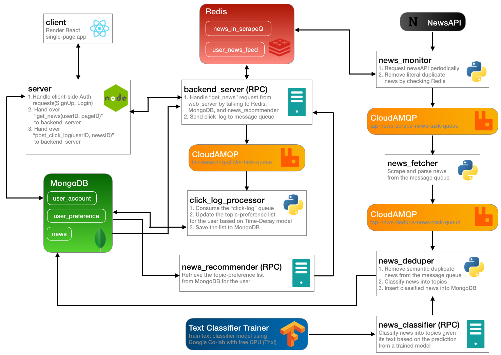

# Real-time News Scraping and Recommendation System

This system is a complex web application for users to read pensonalized news content around the world. 

## Architect

The major components are:

* Front-End: 
	* renders a React single-page application
* Node Server:
	* handles the client-side Authentication request (SignUp, Login)
	* hands over "get\_news(userID, pageID)" to backend server
	* hands over "post\_click\_log(userID, newsID)" to backend server
* Backend Server (RPC):
	* handles the "get_news" request from the web server
	* sends click\_log to message queue
* Recommendation (RPC):
	* updates the user's topic-preference list based on their click behavior
	* recommends news that belong to the user's interested topics
* Real-time News Data Pipeline:
	* monitors and scrapes news from various media sources and save them into a database
	* removes literal and semantic duplicate news
* News Classifier:
	* classifies news into topic categories given their text

## Tech Stack

* [React](https://reactjs.org) - A JavaScript library for building user interfaces
* [ExpressJS](https://expressjs.com) - a minimal and flexible Node.js web application framework that provides a robust set of features for web and mobile applications
* [MongoDB](https://www.mongodb.com) - a cross-platform document-oriented database program
* [Redis](https://redis.io) - an in-memory data structure project implementing a distributed, in-memory key-value database with optional durability
* [CloudAMQP](https://www.cloudamqp.com) - RabbitMQ (an open-source message-broker software that originally implemented the Advanced Message Queuing Protocol) as a service 
* [Keras](https://keras.io) - an open-source neural-network library written in Python
* [Tensorflow](https://www.tensorflow.org) - a free and open-source software library for dataflow and differentiable programming across a range of tasks
* [News API](https://newsapi.org) - A JSON API for live news and blog articles
* [JSONRPClib](https://jsonrpclib-pelix.readthedocs.io/en/latest/) - a library implements the JSON-RPC 2.0 proposed specification in pure Python

## Build Guide

1. [UI-Design](./build_guide/part1-ui-design.md)
2. [Node Server](./build_guide/part2-node-server.md)
3. [Authentication](./build_guide/part3-authentication.md)
4. [MongoDB, RabbitMQ](./build_guide/part4-mongodb-rabbitmq.md)
5. [Data Pipeline](./build_guide/part5-data-pipeline.md)
6. [Pagination, Click log collector](./build_guide/part6-pagination-click_log_collector.md)
7. [Recommendation](./build_guide/part7-recommendation.md)
8. [Classifier](./build_guide/classifier.md)

