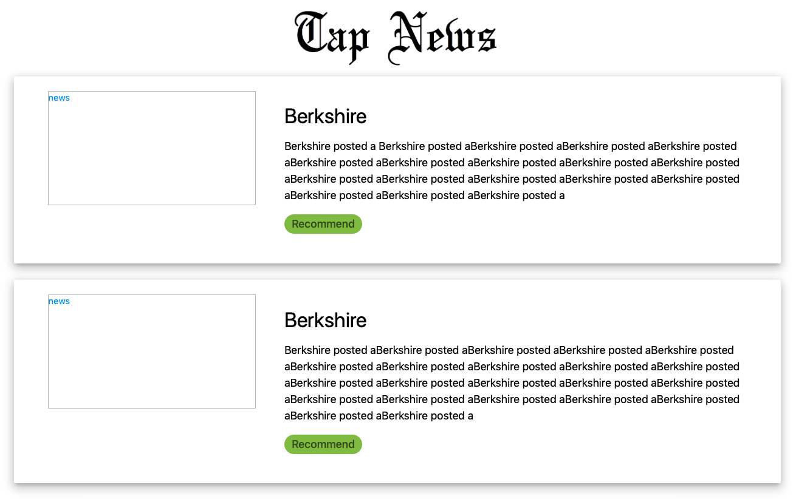

# Part 1 - UI Design

React components to be built:

1. App: tap-news logo + NewsPanel
2. NewsPanel: a list of NewsCard, When a user scrolling, bachend send new NewsCard continously
3. NewsCard: one single news with json-like data (source, title, description, url, urlToImage, publishedAt, digest, reason). Its image, title, description, and tags are presented.

## Step 1. install `npm`
`npm` is a package manager for JavaScript. It is the default package manager for the JavaScript runtime environment Node.js. To install, download from its [official page](https://www.npmjs.com/get-npm).
## Step 2. install `create-react-app`
To install `create-react-app` globally, add `-g`. To more infomation about global vs local installation, refer to this [blog](https://flaviocopes.com/npm-packages-local-global/).

```
sudo npm install -g create-react-app
```
## Step 3. create our front end UI react app

```
create-react-app tap-news
```

## Step 4. install `materialize-css` locally inside our `tap-news`

`materialize-css` provides various UI style design like grid, shadow, etc. Here is its [official page](https://materializecss.com).

It's recommended to install `materialize-css` via npm since CDN method might produce fetch lag that affecting user's experience.

```
cd tap-news
sudo npm install --save materialize-css
```

See [this](https://stackoverflow.com/questions/19578796/what-is-the-save-option-for-npm-install) stackoverflow post for `--save` usage.

Now, start our application to see a react welcome page

```
npm start
```


## Step 5. add component `App`

`tap-news/src/index.js` is the root of our tap-news application. Its html coat is at `tap-news/public/index.html`

`tap-news/src/serviceWorker.js` functions as cache to boost performance.

```
# inside tap-news/src
rm App.css, App.js, App.test.js, index.css, logo.svg
```

Now, we are going to create seperate folders for each component.

```
# inside tap-news/src
mkdir App
```

Create App's js and css files

```javascript
// App.js
import 'materialize-css/dist/css/materialize.min.css';
import './App.css';

import React from 'react';
import logo from './logo.png';
import NewsPanel from '../NewsPanel/NewsPanel';

class App extends React.Component {
  render() {
    return (
      <div>
         
        <div className = 'container'>
          <NewsPanel />
        </div>
      </div>
    );
  }
}

export default App;
```

Note:

1. `materialize.min.css` is used since `min` is a compressed unreadable but faster-rendering version.
2. `className` is used in html since `class` is a keyword in javascript.
3. `export default App;` default is used so that when caller imported, `{}` is no longer needed. In this project, one js file only contains one component/class. If a utility js file contains multiple classes. Import them using `{}`.

```javascript
export class MyClass1 extends Component {
  ...
}

export class MyClass2 extends Component {
  ...
}

import {MyClass1, MyClass2} from './myClass'
```

4. To highlight jsx syntax, `babel` is recommended for sublime users.

```css
/*App.css*/
.App {
  text-align: center;
}

.logo {
  display: block;
  margin-left: auto;
  margin-right: auto;
  padding-top: 30px;
  width: 20%;
}
```

## Step 6. add component `NewsPanel`

```
# inside tap-news/src
mkdir NewsPanel
```

```javascript
// NewsPanel.js
import './NewsPanel.css';
import React from 'react'
import NewsCard from '../NewsCard/NewsCard';

class NewsPanel extends React.Component {
  constructor() {
    super();
    this.state = {news: null};
  }
  componentDidMount() {
    this.loadMoreNews();
  }
  loadMoreNews() {
    this.setState({
      news: [
        {
          "srouce": "The Wall Street Journal",
          "title": "Berkshire",
          "description": "Berkshire posted a Berkshire posted aBerkshire posted aBerkshire posted aBerkshire posted aBerkshire posted aBerkshire posted aBerkshire posted aBerkshire posted aBerkshire posted aBerkshire posted aBerkshire posted aBerkshire posted aBerkshire posted aBerkshire posted aBerkshire posted aBerkshire posted aBerkshire posted a",
          "url": "https:",
          "utlToImage": "",
          "publishedAt": "2018-02-",
          "digest": "3Rju",
          "reason": "Recommend"
        },
        {
          "srouce": "The Wall Street Journal",
          "title": "Berkshire",
          "description": "Berkshire posted aBerkshire posted aBerkshire posted aBerkshire posted aBerkshire posted aBerkshire posted aBerkshire posted aBerkshire posted aBerkshire posted aBerkshire posted aBerkshire posted aBerkshire posted aBerkshire posted aBerkshire posted aBerkshire posted aBerkshire posted aBerkshire posted aBerkshire posted aBerkshire posted aBerkshire posted aBerkshire posted aBerkshire posted a",
          "url": "https:",
          "utlToImage": "",
          "publishedAt": "2018-02-",
          "digest": "3Rju",
          "reason": "Recommend"
        }
      ]
    });
  }
  renderNews() {
    const news_list = this.state.news.map(news => {
      return (
        <a className = 'list-group-item' key = {news.digest} href = '#'>
          <NewsCard news = {news} />
        </a>
      );
    });

    return (
      <div className = 'container-fluid'>
        <div className = 'list-group'>
          {news_list}
        </div>
      </div>
    );
  }
  render() {
    if (!this.state.news) {
      return (
        <div>
          Loading...
        </div>
      );
    } else {
      return (
        <div>
          {this.renderNews()}
        </div>
      );
    }
  }
}

export default NewsPanel;
```

Also add an empty `NewsPanel.css`. 

Note:
 
1. A philosophy design convention is design by top-down instead of bottom-up. An advantage of "top-down" is developers always have a better control at top level. A disadvantage is the application is only working after all bottom layers have been built.
2. Fake data is generated and fed into the news list by setting state. More usage about `setState()` is given [here](https://medium.freecodecamp.org/get-pro-with-react-setstate-in-10-minutes-d38251d1c781). Understanding render-cycle at [here](https://stackoverflow.com/questions/24718709/reactjs-does-render-get-called-any-time-setstate-is-called). 
3. `<NewsCard news = {news} />` passes a property `news` to the `NewsCard` component which will be addressed later.
4. `render(), constructor(), componentDidMount()` are built-in functions that are overridden here.
5. `componentDidMount()` gets called after `constructor()` is called.

## Step 7. add component `NewsCard`

```
# inside src
mkdir NewsCard
```

```javascript
// NewsCard.js
import './NewsCard.css'

import React from 'react'

class NewsCard extends React.Component {
  redirectToUrl(url, event) {
    event.preventDefault();
    this.sendClickLog();
    window.open(url, '_blank');
  }

  render() {
    return(
      <div className="news-container" onClick={(event) => this.redirectToUrl(this.props.news.url, event)}>
      <div className='card-panel z-depth-3'>
        <div className="row">
          
          <div className='col s4 fill'>
            
          </div>
          
          <div className="col s8">
            <div className="news-intro-col">
              <div className="news-intro-panel">
                <h4>{this.props.news.title}</h4>
                <div className="news-description">
                  <p>{this.props.news.description}</p>
                  <div>
                    {this.props.news.source != null && <div className='chip light-blue news-chip'>{this.props.news.source}</div>}
                    {this.props.news.reason != null && <div className='chip light-green news-chip'>{this.props.news.reason}</div>}
                    {this.props.news.time != null && <div className='chip amber news-chip'>{this.props.news.time}</div>}
                  </div>
                </div>
              </div>
            </div>
          </div>
        
        </div>
      </div>
      </div>
    );
  }
}

export default NewsCard;
```
Note:

1. `z-depth-3` sets shadow effect.
2. For `redirecttoUrl` function, redirect is triggered at current page so that our app exits. Hence, `preventDefault()` and `_blank` are used here to avoid app escape.

```css
/*NewsCard.css*/
.news-container {
  padding-top: 5px;
}

.news-intro-col {
  display: inline-flex;
  color: black;
  height: 100%;
}

.news-intro-panel {
  margin: auto 5px;
  text-align: left;
}

.news-description {
  text-align: left;
}

.news-description p {
  font-size: 18px;
}

.news-chip {
  font-size: 18px;
}

.fill {
  display: flex;
  justify-content: center;
  align-items: center;
  overflow: hidden;
}

.fill img {
  padding-left: 20px;
  padding-right: 20px;
  flex-shrink: 0;
  min-width: 100%;
  max-height: 250px;
  object-fit: cover;
}
```

## Step 8. add `App` in `index.js`

```javascript
// index.js
import React from 'react';
import ReactDOM from 'react-dom';
import App from './App/App';
import * as serviceWorker from './serviceWorker';

ReactDOM.render(<App />, document.getElementById('root'));

// If you want your app to work offline and load faster, you can change
// unregister() to register() below. Note this comes with some pitfalls.
// Learn more about service workers: https://bit.ly/CRA-PWA
serviceWorker.unregister();
```




